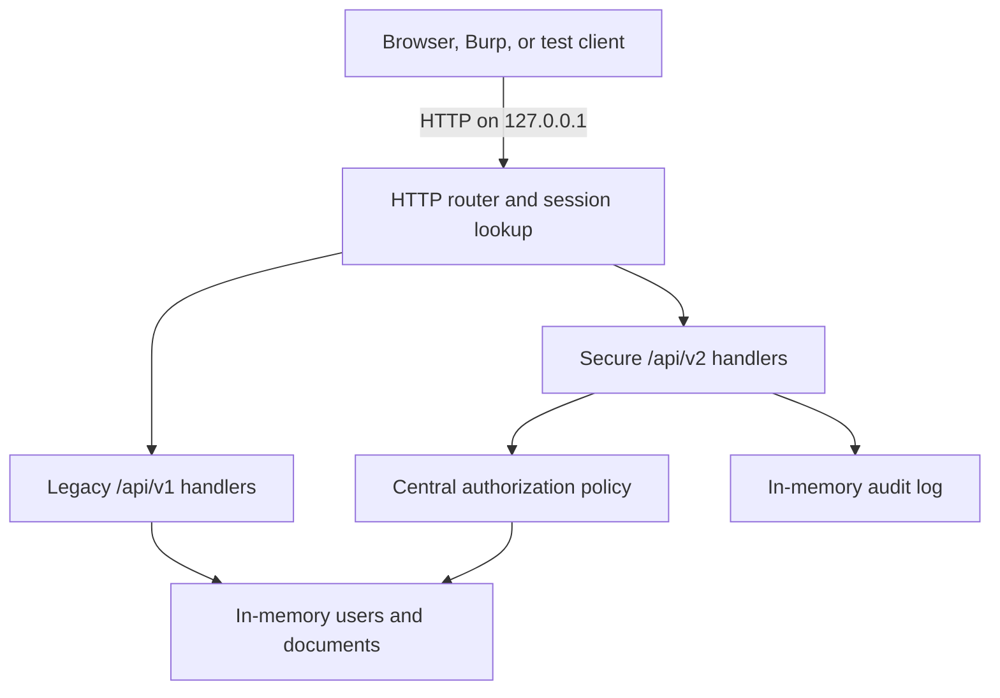

# AcmeDocs Capstone Architecture

## Purpose

This local application models a small multi-tenant document API. It keeps the
data model deliberately simple so the security comparison focuses on where and
how authorization is enforced.

## Components

- `server.py` parses HTTP requests, resolves routes and authenticated actors,
  invokes authorization, validates request bodies, serializes responses, and
  records privileged audit events.
- `authorization.py` is the central, deny-by-default policy. It grants only
  known actions to valid actors with the required role, tenant, and ownership
  relationship.
- `data.py` contains fictional users, documents, server-side sessions, response
  and write allowlists, state reset logic, and the in-memory audit log.
- `test_authorization.py` starts an ephemeral localhost server and validates
  both the expected v1 weaknesses and the expected v2 controls.

## Data flow

## Trust boundaries

### TB-1 — Client to local HTTP server

Everything in the URL, query string, headers, cookies, method, and body is
client-controlled. The server uses only an opaque session value to locate the
actor; role and tenant values sent by the client are not authority.

### TB-2 — Request handler to central policy

The handler supplies a server-resolved actor, a specific action, and the
relevant resource or target tenant. Missing actors, unknown actions, malformed
resources, and unrecognized roles are denied.

### TB-3 — Policy decision to state mutation

Authorization and full input validation occur before a v2 mutation. A denial
or validation error therefore leaves the stored document unchanged. A real
database implementation would place authorization-sensitive lookup and update
inside an appropriate transaction to reduce time-of-check/time-of-use risk.

## Identity and session model

`POST /demo-login` accepts only a fictional username and creates a random,
server-side session. The session maps to the canonical user record. Extra
client fields such as `role` or `tenant_id` are ignored.

This is a demonstration mechanism, not production authentication. Production
would require credential verification, expiry, rotation, revocation,
reauthentication for sensitive operations, CSRF defenses, TLS, and secure
session lifecycle monitoring.

## Authorization model

The policy evaluates four elements:

1. actor validity;
2. requested action;
3. target resource or tenant;
4. role, tenant, and ownership relationship.

The default outcome is denial. Route handlers cannot obtain a grant by passing
an unknown action. Document collection results are filtered using the same
object-level read policy used for individual documents.

## Property authorization

The secure update path accepts only `title` and `content`. Security-sensitive
attributes such as `tenant_id`, `owner_id`, and `role` cannot be assigned by
the client. The secure response serializer returns only `id`, `owner_id`,
`title`, and `content`; it omits `tenant_id` and `internal_label`.

## Privileged operations and audit

Organization exports require a matching tenant administrator. Tenant support
operations and audit-log reads require the platform support administrator.
Privileged v2 attempts record the server-resolved actor, role, action, target,
timestamp, and outcome. Both allowed and denied attempts are attributable.

## Legacy comparison boundary

The v1 handlers intentionally stop at authentication. They return internal
objects, accept excessive properties, expose cross-tenant objects, and allow
privileged functions to any authenticated actor. These routes exist only to
make the policy discrepancy testable and are a production release blocker.

## Known limitations

- State and audit events are in memory and disappear on restart.
- The lab does not implement a real identity provider or password flow.
- It does not model concurrent database transactions or distributed caches.
- Rate limiting, CSRF protection, TLS, durable audit integrity, and storage
  authorization are outside this small local implementation.
- The server must remain bound to `127.0.0.1`.
