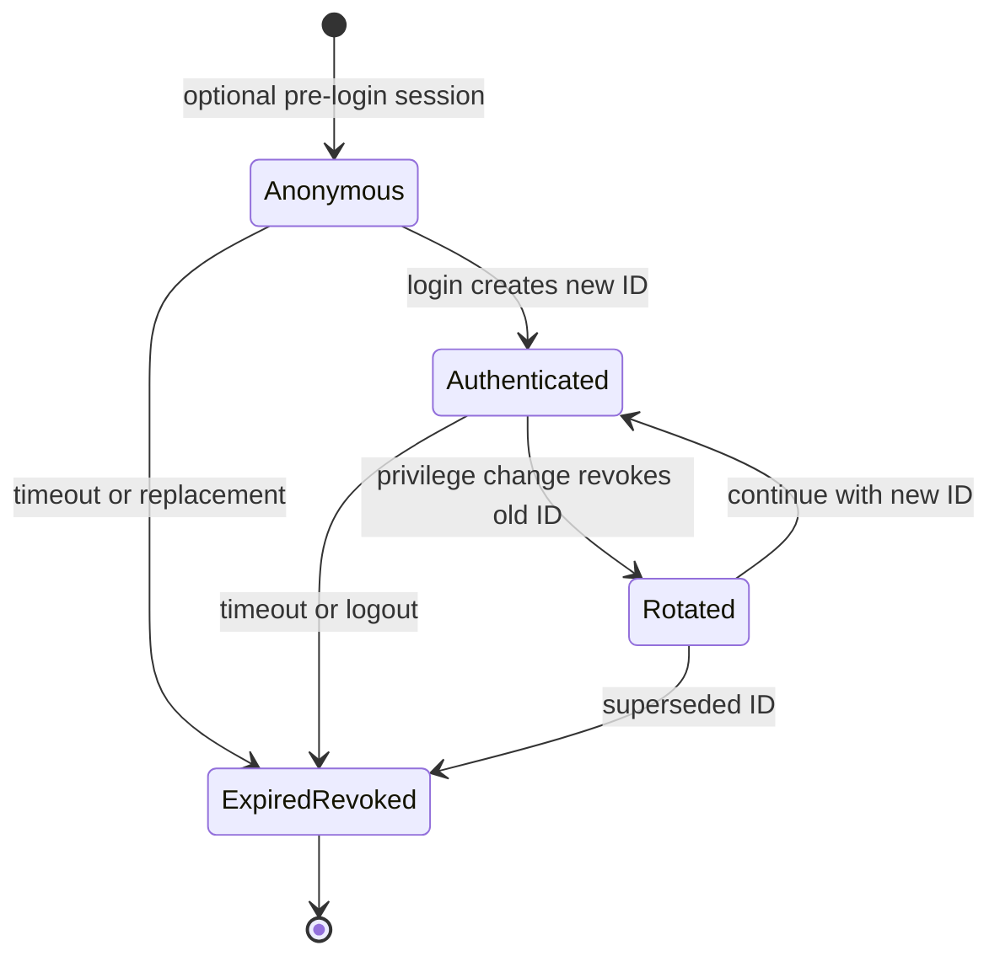

# Session Lifecycle

## State model

`Rotated` is a security transition rather than a long-lived record state. During
that transition the old record becomes revoked and a new authenticated record
is issued. The new record inherits the original absolute expiry deadline.

## Transition rules

| From | Event | Required server action | Old token |
|---|---|---|---|
| No session | Pre-login | Issue opaque anonymous token | Not applicable |
| Anonymous | Login | Revoke old and issue authenticated token | Rejected |
| Authenticated | Login again | Revoke old and issue new authenticated token | Rejected |
| Authenticated | Trusted privilege change | Revoke old, issue elevated token, preserve absolute expiry | Rejected |
| Active | Idle or absolute deadline | Mark record expired before handling request | Rejected |
| Active | Logout | Revoke record and clear cookie | Rejected |
| Revoked/expired | Replay | Deny without restoring state | Rejected |

## Engineering questions

### Are entropy and token length the same thing?

No. Length is the number of bytes or encoded characters. Entropy measures the
number of unpredictable possibilities. Encoding 32 random bytes as 64 hex
characters changes its visible length but keeps 256 bits of entropy. A much
longer predictable string could still be weak.

### Why does HttpOnly not stop CSRF?

`HttpOnly` prevents JavaScript from reading the cookie value. The browser still
attaches that cookie automatically to matching requests, including some requests
initiated by another site. CSRF exploits automatic sending, not necessarily
JavaScript access to the token.

### Why is SameSite not a complete CSRF defense?

`SameSite` depends on browser behavior, request context, method, navigation, and
site boundaries. It can also be weakened by application design and same-site
subdomains. Sensitive state changes should still use explicit CSRF defenses,
origin validation where appropriate, safe HTTP methods, and authorization.

### What is the difference between idle and absolute timeout?

Idle timeout expires a session after no accepted activity for a configured
period and is refreshed by valid requests. Absolute timeout expires it after a
fixed lifetime even if the user remains active. The first limits unattended
sessions; the second limits the useful lifetime of a stolen active token.

### Why rotate after a privilege change?

A previously copied token may be known to another party. If the same identifier
survives an elevation, that copied token silently gains the new authority.
Rotation binds the new privilege context to a fresh identifier and invalidates
the earlier one.
