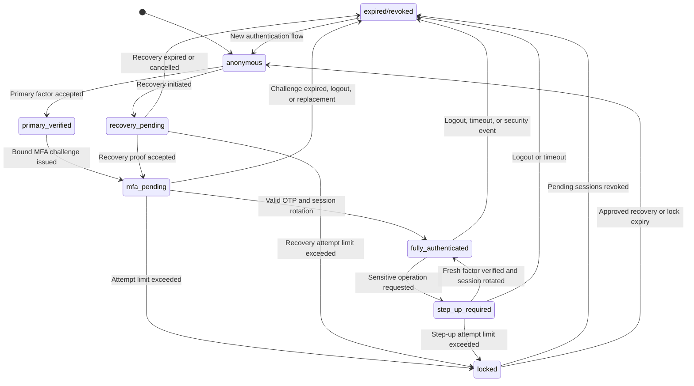

# MFA State Machine

## State diagram

## State meanings

### anonymous

No verified identity exists. The client can access public resources and begin
login or recovery, but cannot access account data.

### primary_verified

The primary factor has succeeded. This is a short-lived transitional state and
must not be treated as authenticated access.

### mfa_pending

A challenge has been issued and bound server-side to the user, pending session,
purpose, expiry, and attempt counter.

### fully_authenticated

All required factors have succeeded. Protected endpoints can be accessed only
when their separate authorization policy also allows the action.

### step_up_required

The existing session is valid for ordinary actions but a sensitive action
requires recent factor verification.

### recovery_pending

An account-recovery flow is active. Recovery does not automatically grant
normal account access.

### locked

The verification or recovery attempt limit has been exceeded. Additional
verification attempts are rejected.

### expired/revoked

The session or challenge is no longer usable because of expiry, logout,
rotation, resend, factor replacement, or another security event.

## Endpoint policy by state

| State | Permitted endpoints | Endpoints that must be rejected |
|---|---|---|
| `anonymous` | Public content, login start, recovery start | Account, admin, export, factor-management and protected API endpoints |
| `primary_verified` | MFA challenge creation and logout | All ordinary and sensitive authenticated functions |
| `mfa_pending` | MFA verification, limited resend and logout | Account data, API data, exports, billing and factor replacement |
| `fully_authenticated` | Authorized application functions and logout | Functions denied by role, tenant, ownership or step-up policy |
| `step_up_required` | Step-up verification, cancellation and logout | The sensitive operation until fresh verification succeeds |
| `recovery_pending` | Recovery verification, limited resend and cancellation | Account data, active sessions and ordinary factor-management endpoints |
| `locked` | Approved recovery/help flow and logout | MFA verification, protected resources and sensitive operations |
| `expired/revoked` | New login or recovery start | Every endpoint that accepts the old session or challenge |

## Trust boundaries

- The browser is untrusted and cannot select the verified user or authentication state.
- Primary credentials cross into the authentication service but do not cross the MFA boundary.
- OTP validation crosses the MFA boundary only after server-side binding checks succeed.
- Authorization remains a separate control after full authentication.
- Email, SMS, push, and recovery providers are external dependencies and must fail securely.

## Required invariants

- A protected endpoint never infers authentication from page navigation.
- A client-controlled user identifier never selects the MFA subject.
- One challenge belongs to one user, session, purpose, and limited lifetime.
- Challenge consumption and session elevation are atomic.
- Session identifiers rotate after MFA and step-up success.
- Old, expired, replaced, and revoked values cannot be replayed.
